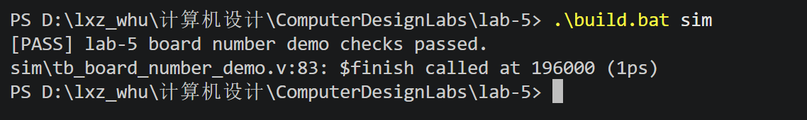
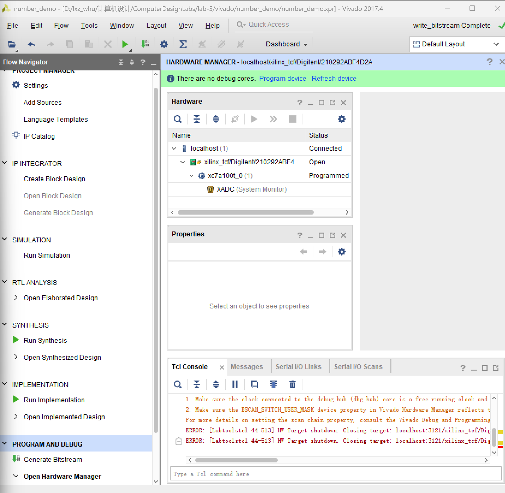
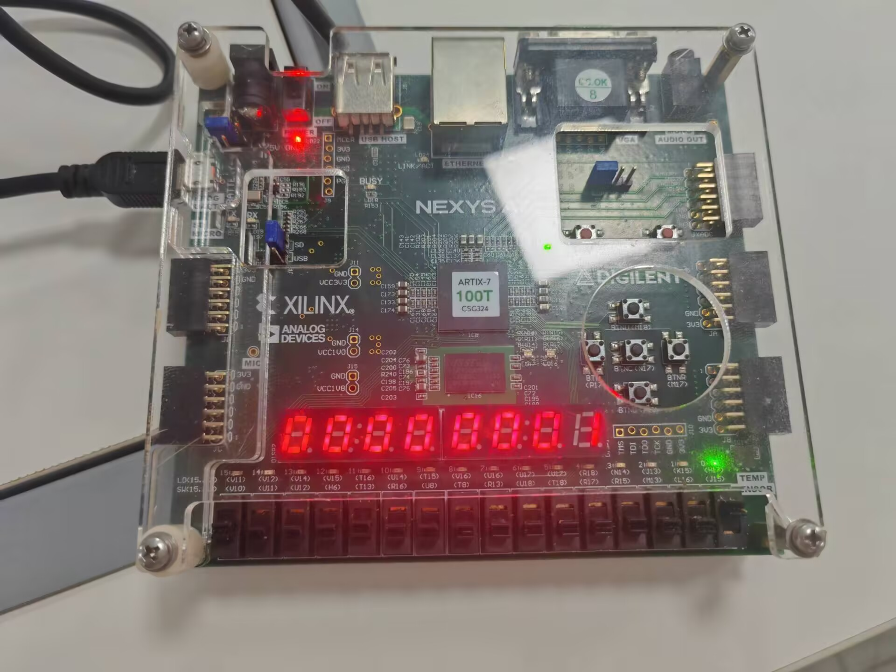
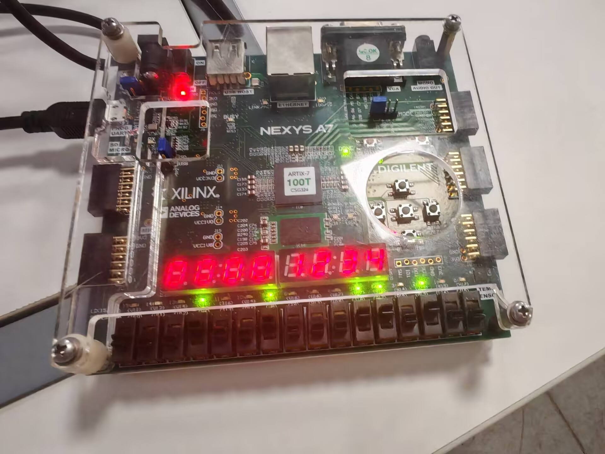

# Lab-5 Vivado 开发板读数字亮数字 Demo 实验报告

李熙正 2024302181141
日期：2026 年 5 月 14 日

## 一、实验目的

本实验使用 Vivado 建立一个最小开发板工程，用于验证 Nexys4 DDR 开发板的输入与显示输出功能是否正常。实验目标如下：

1. 读取开发板上的 16 位拨码开关 `sw_i[15:0]`。
2. 使用 16 位 LED `led_o[15:0]` 直接显示拨码开关状态。
3. 使用 8 位七段数码管显示 `{16'h0000, sw_i}` 对应的 32 位十六进制数。

例如，当拨码开关输入为 `16'h1234` 时，LED 应与对应二进制位同步亮灭，数码管应显示 `00001234`。

## 二、实验环境

| 项目 | 内容 |
| --- | --- |
| 开发板 | Nexys4 DDR |
| FPGA 芯片 | Artix-7 `xc7a100tcsg324-1` |
| 开发工具 | Vivado 2017.4 |
| 仿真工具 | Icarus Verilog (`iverilog` / `vvp`) |
| 操作系统 | Windows |

## 三、仿真验证

在 `lab-5` 目录下运行自动仿真命令：

```powershell
.\build.bat sim
```

仿真结果显示：

```text
[PASS] lab-5 board number demo checks passed.
```

这说明 testbench 已经验证 LED 能跟随拨码开关变化，七段数码管也能正确显示测试输入的十六进制值。



## 四、Vivado 工程创建与 bitstream 生成

在 Vivado 中创建工程后，确认顶层模块为 `board_number_demo`，并依次执行：

```text
Run Synthesis
Run Implementation
Generate Bitstream
```

综合、实现和 bitstream 生成完成后，打开 Hardware Manager，连接开发板并执行 Program Device。烧录完成后，Vivado 中设备状态显示为 `Programmed`，说明 bitstream 已成功下载到开发板。



## 五、上板验证

烧录完成后，通过拨动开发板上的 16 个拨码开关进行验证。验证时主要观察以下现象：

1. LED 是否与拨码开关一一对应。
2. 数码管低 4 位是否显示拨码开关组成的 16 位十六进制值。
3. 数码管高 4 位是否显示 `0000`。

### 1. LED 与拨码开关对应验证

拨动不同位置的开关后，对应位置 LED 亮灭随之改变，说明 `led_o[15:0] = sw_i[15:0]` 的直连逻辑正确。


### 2. 数码管低位显示验证

拨码开关设置为较小数值时，数码管高位保持为 `0000`，低位显示当前输入值。例如只拨动低位开关时，数码管显示结果与拨码输入一致。



### 3. 多位十六进制输入验证

进一步拨动多个开关组成多位十六进制数，数码管能够显示形如 `0000xxxx` 的结果，说明 16 位开关输入已经正确扩展并送入 8 位七段数码管显示模块。



## 六、实验结果

本实验完成了开发板输入与显示输出的验证：

1. 仿真阶段，`.\build.bat sim` 自动测试通过。
2. Vivado 阶段，工程成功创建，并完成综合、实现与 bitstream 生成。
3. 上板阶段，开发板成功烧录，LED 能够跟随拨码开关变化。
4. 七段数码管能够显示 `{16'h0000, sw_i}` 对应的 8 位十六进制数。

实验结果符合 README 中给出的功能要求。

## 七、实验总结

通过本次实验，我熟悉了从 Verilog 源码到 FPGA 上板验证的完整流程，包括仿真验证、Vivado 工程创建、约束文件使用、综合实现、bitstream 生成以及 Hardware Manager 下载。实验结果表明，拨码开关输入、LED 输出和七段数码管动态显示均能正常工作，达到了验证开发板基本输入输出功能的目的。
